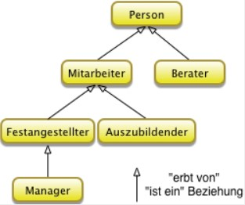
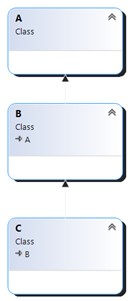

# Vererbung und Polymorphie

## Grundlagen der Vererbung
</br>

Die objektorientierte Programmierung stützt sich auf 3 Grundpfeiler: 

* Datenkapselung
* Vererbung
* Polymorphie

Die Vererbung (Inheritance) ist somit ein wichtiges Konzept in der objektorientierten Programmierung. Mit Hilfe von einer selbst definierten Klasse kann das Verhalten in weiteren Klassen wiederverwendet, geändert oder auch erweitert werden. Die Klasse, die ihr Verhalten weiterreicht, wird Basisklasse genannt und Klassen, die das Verhalten annehmen, werden abgeleitete Klassen. Gängige Bezeichnungen für die Basisklasse sind unter anderem Ober-, Super- oder auch Elternklasse und die abgeleitete Klasse wird des Öfteren unter dem Namen Unter-, Sub- oder auch Kinderklasse erwähnt. Zwischen der Basis- und auch der Subklasse herrscht bei der Vererbung eine dauerhafte Beziehung. Mit Hilfe der Vererbung kann man den Programmieraufwand reduzieren und die Programmstruktur übersichtlicher gestalten. Neben der definierten Basisklasse erben auch alle anderen Klassen immer direkt oder indirekt von `object`.

</br>

## Ziele
</br>

In der Programmierung werden die Wiederverwendung und die Modellierung in Hierarchien angestrebt. Unter Wiederverwendung versteht man, dass man die Gemeinsamkeiten von Klassen herausfiltert (Generalisieren), diese in der Basisklasse implementiert und danach an weitere Subklassen weitervererbt. Es werden Daten und Methoden an die nächste Klasse weitergereicht (vererbt). Die Subklassen können nach Belieben erweitert werden und es kann auch eine ursprüngliche Methode der Basisklasse überschrieben werden. Die Modellierung in Hierarchien hat zur Folge, dass Abgrenzungen zwischen ähnlichen Objekten getroffen werden und dadurch wird auch das Verständnis für Vererbung und Polymorphie vereinfacht.

Bsp. einer Vererbungshierarchie:




</br>

## Mehrfachvererbung
</br>

Prinzipiell wird in der Programmierung zwischen Ein- und Mehrfachvererbung unterschieden. Bei der Einfachvererbung erbt eine Klasse von einer Basisklasse und bei der Mehrfachvererbung kann von mehreren Basisklassen geerbt werden. C# unterstützt keine Mehrfachvererbung, jedoch wird bei C# transitiv vererbt. Dies bedeutet, dass die Klasse C direkten Zugriff auf die Member von A hat, wenn B von A und C von B erbt.

Bsp. transitive Vererbung:



</br>

## Probleme bei der Vererbung
</br>

Speziell die Mehrfachvererbung kann zur Folge haben, das unerwartete Nebeneffekte auftreten da die Mehrfachvererbung sehr komplex und unüberschaubar werden kann. Um diese Nebeneffekte zu unterbinden, wird die Mehrfachvererbung in C# nicht unterstützt. Jedoch wird in C# transitiv vererbt und man kann sich mit Interfaces behelfen.

</br>

## Polymorphie
</br>

Polymorphie (Vielgestaltigkeit) ist auch ein Konzept der objektorientierten Programmierung wobei die Schlüsselwörter `virtual` und `abstract` die Basis dafür bilden. Unter Polymorphie versteht man, dass unterschiedliche Methoden gleichen Namens existieren.

</br>

## Schlüsselwörter
</br>

`base` : 

Wenn beim Konstruktor das Schlüsselwort `base` verwendet wird, wird der übergeordnete Konstruktor aufgerufen.

```ruby

public Worker (string name, string department)
    : base(name, department)
{
}

```

`sealed`:

Mit `sealed` wird in der Basisklasse eine Methode daran gehindert, dass sie weiter vererbt wird.

</br>

`virtual` / `override` :

Methoden in der Basisklasse die mit `virtual` versehen sind, kann man in der abgeleiteten Klasse verwenden und mit `override` überschreiben. Das Verhalten wird hier mitverwenden und / oder angepasst:


```ruby

public class A                        
{
    public virtual string Method()
    {
        return "Ein Auto";
    }
}

#Output
Ein Auto


public class B : A
{
    public override void Method()
    {
        return base.Method() + "und ein Motorad";
    }
}

#Output
Ein Auto und ein Motorrad

```
</br>

`abstract` / `override` :

Ist eine Basisklasse mit `abstract` versehen, kann keine Instanz davon erstellt werden. Ist eine Methode mit `abstract` gekennzeichnet, muss in der Subklasse dies implementiert und mit der Methode mit `override` überschrieben werden.

```ruby

public abstract class A
{
    public abstract string Method();
}

public class B
{
    public override string Method()
    {
        return "Hello World";
    }
}

#Output
Hello World

```

</br>

[Zur Übersicht](../README.md)